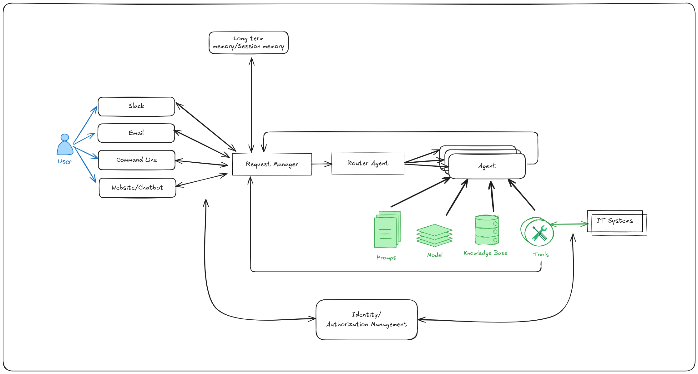
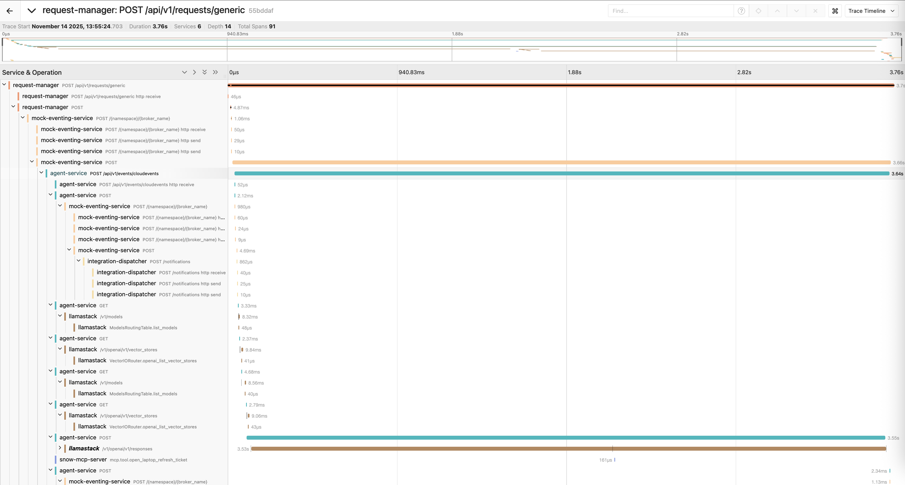

# Self-Service Agent Quickstart

## Table of Contents

1. [Introduction](#1-introduction)
   - [Who Is This For?](#11-who-is-this-for)
   - [The Business Case for AI-Driven IT Self-Service](#12-the-business-case-for-ai-driven-it-self-service)
   - [Example Use Cases](#13-example-use-cases)
   - [What This Quickstart Provides](#14-what-this-quickstart-provides)
   - [What You'll Build](#15-what-youll-build)
   - [Architecture Overview](#16-architecture-overview)
   - [Project Structure](#17-project-structure)
   - [Laptop Refresh Implementation](#18-laptop-refresh-implementation)
   - [Customizing for Your Use Case](#19-customizing-for-your-use-case)

2. [Prerequisites](#2-prerequisites)

3. [Hands-On Quickstart](#3-hands-on-quickstart)
   - [Deploy to OpenShift](#31-deploy-to-openshift)
   - [Interact with the CLI](#32-interact-with-the-cli)
   - [Integration with Slack (Optional)](#33-integration-with-slack-optional)
   - [Integration with Real ServiceNow (Optional)](#34-integration-with-real-servicenow-optional)
   - [Integration with Email (Optional)](#35-integration-with-email-optional)
   - [Setting up Safety Shields (Optional)](#36-setting-up-safety-shields-optional)
   - [Run Evaluations](#37-run-evaluations)
   - [Follow the Flow with Tracing](#38-follow-the-flow-with-tracing)

4. [Performance & Scaling](#4-performance--scaling)

5. [Going Deeper: Component Documentation](#5-going-deeper-component-documentation)
   - [Guides](#guides)
   - [Technical Documentation](#technical-documentation)

6. [Customizing for Your Use Case](#6-customizing-for-your-use-case)

7. [Next Steps and Additional Resources](#7-next-steps-and-additional-resources)
   - [What You've Accomplished](#71-what-youve-accomplished)
   - [Recommended Next Steps](#72-recommended-next-steps)

---

## 1. INTRODUCTION

### 1.1 Who Is This For?

This quickstart guide is designed for:

- **IT teams** implementing AI-driven self-service solutions
- **DevOps engineers** deploying agent-based systems
- **Solution architects** evaluating AI automation platforms
- **Organizations** looking to streamline IT processes with generative AI

### 1.2 The Business Case for AI-Driven IT Self-Service

Many organizations are working to support IT processes through generative AI based self-service implementations. IT teams at Red Hat have already started on this journey. The team building this quickstart met with those teams to incorporate the lessons learned into this guide.

The key value propositions for implementing IT processes with generative AI include:

* **Reduced employee time to complete common requests.** The system helps employees create their requests by helping them understand the options and required information for the request and helps employees submit those requests once they are ready.
* **Higher compliance to process standards.** Requests will be more complete and aligned with process standards. This will reduce the need to contact the requesting employee for additional information and reduce time and effort to review and complete requests.
* **Fewer rejected requests due to missing/incorrect information.** Rejected requests are frustrating for employees and leads to lower employee satisfaction. Avoiding request rejection and reducing back and forth on requests will improve employee satisfaction.
* **Shorter time to close a ticket.** The system helps tickets to close faster, improving throughput and reducing ticket idle time.

### 1.3 Example Use Cases

IT processes that are suitable for automation with generative AI include:

* Laptop refresh requests
* Privacy Impact Assessment (PIA)
* RFP generation
* Access request processing
* Software license requests

### 1.4 What This Quickstart Provides

This quickstart provides the framework, components and knowledge to accelerate your journey to deploying generative AI based self-service implementations. Many AI based IT process implementations should be able to share common components within an enterprise. The addition of agent configuration files, along with additional tools, knowledge bases, and evaluations, completes the implementation for a specific use case. Often no code changes to the common components will be required to add support for an additional use case.

### 1.5 What You'll Build

The quickstart provides implementations of the common components along with the process specific pieces needed to support the laptop refresh IT process as a concrete implementation.

**Time to complete:** 30-60 minutes (depending on deployment mode)

By the end of this quickstart, you will have:
- A fully functional AI agent system deployed on OpenShift
- A working laptop refresh agent with knowledge bases and MCP server tools
- Experience interacting with the agent via CLI to test complete workflows
- Completed evaluation runs demonstrating agent quality and business requirements
- Understanding of distributed tracing for monitoring and troubleshooting
- (Optional) Slack integration for real-time user conversations
- (Optional) Email integration for asynchronous notifications
- (Optional) ServiceNow integration for real ticket creation
- (Optional) Safety shields for content moderation
- Understanding of how to customize for your own use cases

### 1.6 Architecture Overview

The self-service agent quickstart provides a reusable platform for building AI-driven IT processes:



In addition to the base components, the quickstart includes an evaluation framework and integration with OpenTelemetry support in OpenShift for observability.

**Why Evaluations Matter:**

Generative AI agents are non-deterministic by nature, meaning their responses can vary across conversations even with identical inputs. This makes traditional software testing approaches insufficient. The evaluation framework addresses this challenge by providing capabilities that are crucial for successfully developing and iterating on agentic IT process implementations. The framework validates business-specific requirements—such as policy compliance and information gathering—ensuring agents meet quality standards before deployment and catch regressions during updates.

**Why Observability Matters:**

Agentic systems involve complex interactions between multiple components—routing agents, specialist agents, knowledge bases, MCP servers, and external systems—making production debugging challenging without proper visibility. The OpenTelemetry integration provides distributed tracing across the entire request lifecycle, enabling teams to understand how requests flow through the system, identify performance bottlenecks, and diagnose issues in production. This visibility is essential for monitoring agent handoffs between routing and specialist agents, debugging failed external system integrations, and understanding user interaction patterns. By integrating with OpenShift's observability stack, teams gain unified monitoring across all platform components alongside their existing infrastructure metrics.

**Key Request Flow:**
1. User initiates request through any communications channel (Slack, Email, API, Web)
2. Request Manager validates request and routes to routing agent
3. Routing agent interacts with the user to find out what the user needs
4. Routing agent hands session off to specialist agent to complete the request
5. Specialist agent interacts with user to complete request using available knowledge bases and MCP servers

### 1.7 Project Structure

The repository is organized into the following key directories:

**Core Services:**
- **`agent-service/`** - AI agent processing service with knowledge base management and LangGraph state machine
- **`request-manager/`** - Request routing, session management, and unified communication processing
- **`integration-dispatcher/`** - Multi-channel delivery (Slack, Email, Webhooks)
- **`mock-eventing-service/`** - Lightweight mock service for testing without Knative infrastructure

**MCP Servers:**
- **`mcp-servers/snow/`** - ServiceNow integration MCP server

**Shared Libraries:**
- **`shared-models/`** - Database models, Pydantic schemas, and Alembic migrations
- **`shared-clients/`** - Centralized HTTP client libraries for inter-service communication

**Evaluation & Testing:**
- **`evaluations/`** - Evaluation framework with conversation flows and metrics
- **`test/`** - Testing utilities and scripts

**Infrastructure & Configuration:**
- **`helm/`** - Kubernetes Helm charts for OpenShift deployment
- **`agent-service/config/`** - Agent configurations, knowledge bases, and LangGraph prompts
- **`tracing-config/`** - OpenTelemetry configuration for observability
- **`scripts/`** - CI/CD and container build scripts

**Documentation:**
- **`guides/`** - Step-by-step guides for integrations, deployment, and advanced features
- **`docs/`** - Technical documentation for developers

For detailed information on each component, see the [Component Guide](guides/COMPONENT_GUIDE.md).

### 1.8 Laptop Refresh Implementation

The laptop refresh use case is implemented by adding the following components:

1. MCP server integrated with ServiceNow that can:
   * retrieve existing laptop information for an employee
   * submit a refresh request on behalf of an employee
2. Laptop refresh knowledge base that includes laptop refresh policy and available
   laptop options per region
3. Routing agent that knows how to route to the laptop refresh agent
4. Laptop refresh agent configured with prompts for the refresh process
5. A set of evaluations specific to the laptop refresh IT process

**User Authentication:**

The user's email address is used as the authoritative identifier for the user. Communication channels like Slack and email provide pre-authenticated user identities, eliminating the need for separate authentication. The email address obtained from these channels is passed through the Request Manager to MCP servers, which use it to perform operations on behalf of the user—such as retrieving employee information and submitting refresh requests.

The ServiceNow MCP server authenticates to the ServiceNow backend using a service account, following standard ServiceNow integration patterns.

**Example Conversation: Laptop Refresh Process**

> **User:** Hi, I'm looking to refresh my laptop, can you please guide me through the process and show me the available options?
>
> **Agent:** Your laptop, an EliteBook 840 G7, was purchased on 2019-05-12 and is currently 6 years and 5 months old. The company's laptop refresh policy states that standard laptops will be refreshed every 3 years from the date of issuance. Since your laptop is older than 3 years, you are eligible for a laptop refresh. Would you like to proceed with reviewing the available laptop options for your location?
>
> **User:** Yes, I'd like to proceed with reviewing the available laptop options for my location.
>
> **Agent:** Here are the available laptop options for your location (NA):
>
> **1. Apple MacBook Air M3** (Code: apple_mac_book_air_m_3)
> - Target User: General Office
> - Cost: $1,199 USD
> - Operating System: macOS
> - Display: 13.6" (2560 x 1664)
> - Processor: Apple M3
> - Memory: 8 GB
> - Storage: 256 GB SSD
> - Weight: 2.7 lbs
>
> **2. Apple MacBook Pro 14 M3 Pro** (Code: apple_mac_book_pro_14_m_3_pro)
> - Target User: Developers
> - Cost: $1,999 USD
> - Operating System: macOS
> - Display: 14.2" (3024 x 1964)
> - Processor: Apple M3 Pro
> - Memory: 18 GB
> - Storage: 512 GB SSD
> - Weight: 3.5 lbs
>
> **3. Lenovo ThinkPad T14 Gen 5 Intel** (Code: lenovo_think_pad_t_14_gen_5_intel)
> - Target User: General Office
> - Cost: $1,399 USD
> - Operating System: Windows 11 Pro
> - Display: 14" (1920 x 1200)
> - Processor: Intel Core i7-1555U
> - Memory: 16 GB
> - Storage: 512 GB SSD
> - Weight: 3.2 lbs
>
> **4. Lenovo ThinkPad P1 Gen 7** (Code: lenovo_think_pad_p_1_gen_7)
> - Target User: Engineers
> - Cost: $2,499 USD
> - Operating System: Red Hat Linux
> - Display: 16" (2560 x 1600)
> - Processor: Intel Core i7-13800H
> - Memory: 32 GB
> - Storage: 1 TB SSD
> - Graphics: NVIDIA RTX A1000
> - Weight: 4.1 lbs
>
> Please select one of the above options. Remember to consider your job role and requirements when making your selection.
>
> **User:** I'd like to select option 1, the Apple MacBook Air M3, as it seems suitable for my general office needs.
>
> **Agent:** You've selected the Apple MacBook Air M3. Would you like to proceed with the creation of a ServiceNow ticket for a laptop refresh?
>
> **User:** Yes, please proceed with creating the ServiceNow ticket for the laptop refresh, and can you also let me know what information I need to provide for the ticket?
>
> **Agent:** A ServiceNow ticket for a laptop refresh has been created for you. The ticket number is REQ3143724. Your request will be processed by the IT Hardware Team, and you will receive updates via email as the ticket progresses.
>
> Is there anything else I can help you with?

### 1.9 Customizing for Your Use Case

To adapt this quickstart for your specific IT process:

- Replace laptop refresh agent with your specialist agent (e.g., PIA, RFP)
- Update the routing agent to be able to route to your new specialist agent
- Add MCP servers for your external systems
- Create knowledge base with your policies and documentation
- Build evaluation suite for your business metrics

---

Now that you understand the architecture and capabilities of the self-service agent quickstart, the next section will guide you through the prerequisites and setup steps needed to deploy the system on your OpenShift cluster.

---

## 2. PREREQUISITES

### What You Need

**Local Tools:**
* [Python 3.12+](https://www.python.org/downloads/)
* [uv](https://github.com/astral-sh/uv) - Fast Python package installer
* [Podman](https://podman.io/getting-started/installation) - Container runtime for building images
* [Helm](https://helm.sh/docs/intro/install/) - Kubernetes package manager
* [oc CLI](https://docs.openshift.com/container-platform/latest/cli_reference/openshift_cli/getting-started-cli.html) - OpenShift command line tool
* [git](https://git-scm.com/downloads) - Version control
* make - Build automation (usually pre-installed on Linux/macOS, see [GNU Make](https://www.gnu.org/software/make/))

**Cluster Environment:**
* **Testing Mode**: OpenShift/Kubernetes cluster (no special operators)
* **Production Mode**: OpenShift cluster + [Serverless Operator](https://docs.openshift.com/serverless/latest/install/install-serverless-operator.html) + [Streams for Apache Kafka Operator](https://access.redhat.com/documentation/en-us/red_hat_streams_for_apache_kafka/2.7/html/deploying_and_managing_streams_for_apache_kafka_on_openshift/deploy-tasks_str)

**Access & Credentials:**
* OpenShift cluster access
* Container registry (Quay.io or similar), OPTIONAL, only if you want to make changes
* LLM API endpoint with credentials (Llama 3 70B model)
* LLM API safety model endpoint with credentials, OPTIONAL if you want to enable safety shields (meta-llama/Llama-Guard-3-8B)
* Slack workspace admin access, OPTIONAL if you want to explore integration with Slack
* ServiceNow instance admin access, OPTIONAL if you want to explore integration with ServiceNow

---

## 3. HANDS-ON QUICKSTART

This section walks you through deploying and testing the laptop refresh agent on OpenShift.

### 3.1 Deploy to OpenShift

#### Step 1: Choose Your Deployment Mode

For first deployment, we recommend **Testing Mode (Mock Eventing)**:
- No Knative operators required
- Tests event-driven patterns
- Simpler than production infrastructure

For detailed information about deployment modes, see the [Deployment Mode Guide](guides/DEPLOYMENT_MODE_GUIDE.md).

#### Step 2: Set Required Environment Variables

```bash
# Set your namespace
export NAMESPACE=your-namespace

# Set LLM configuration
export LLM=llama-3-3-70b-instruct-w8a8
export LLM_API_TOKEN=your-api-token
export LLM_URL=https://your-llm-endpoint

# Set integration secrets (optional for initial testing)
export SLACK_SIGNING_SECRET=your-slack-secret  # Optional
export SNOW_API_KEY=your-servicenow-key       # Optional

```

#### Step 3: Build Container Images (Optional)

If using pre-built images, skip this step.

```bash
# Build all images
# Set container registry make sure this is set when you run
# helm-install-test in later steps
export REGISTRY=quay.io/your-org

make build-all-images

# Push to registry
make push-all-images
```

**Expected outcome:** All images built and pushed to registry

#### Step 4: Deploy with Helm

```bash
# Login to OpenShift
oc login --server=https://your-cluster:6443

# Create namespace if needed
oc new-project $NAMESPACE

# Deploy in testing mode (Mock Eventing)
make helm-install-test NAMESPACE=$NAMESPACE
```

**Expected outcome:**
- ✓ Helm chart deployed successfully
- ✓ All pods running
- ✓ Routes created

#### Step 5: Verify Deployment

```bash
# Check deployment status
make helm-status NAMESPACE=$NAMESPACE

# Check pods
oc get pods -n $NAMESPACE

# Check routes
oc get routes -n $NAMESPACE
```

**Expected outcome:**
- All pods in Running state
- Routes accessible
- Agent service initialization completed successfully

**You should now be able to:**
- ✓ Deploy the system to OpenShift
- ✓ Monitor pods and services
- ✓ Troubleshoot deployment issues

---

### 3.2 Interact with the CLI

Now that the system is deployed, let's interact with the agent through the CLI to test a complete laptop refresh workflow.

A key design philosophy of this quickstart is to "meet employees where they are." Rather than creating new communication channels, the system integrates with existing tools like Slack and Email through a general request manager. This allows employees to interact using the communication platforms they already know and use daily.

For initial testing and evaluation purposes, the quickstart includes a simple command line interface (CLI). We'll use the CLI for these first interactions to verify the system works correctly.

#### Step 1: Start Interactive Chat Session

Use the CLI chat script to start an interactive conversation with the agent:

```bash
# Get the request manager pod
export REQUEST_MANAGER_POD=$(oc get pod -n $NAMESPACE -l app=request-manager -o jsonpath='{.items[0].metadata.name}')

# Start interactive chat session
oc exec -it $REQUEST_MANAGER_POD -n $NAMESPACE -- \
  python test/chat-responses-request-mgr.py \
  --user-id alice.johnson@company.com
```

**Expected outcome:**
- Chat client starts in interactive mode
- Agent sends initial greeting
- You see a prompt where you can type messages

#### Step 2: Complete Laptop Refresh Workflow

Follow this conversation flow to test the complete laptop refresh process:

**You:** `I need help with my laptop refresh`

**Expected:** Agent greets you and retrieves your current laptop information

**You:** `I would like to see available laptop options`

**Expected:**
- Agent checks your eligibility based on 3-year policy
- Agent presents available laptop options for your region (NA, EMEA, APAC, or LATAM)
- You see 4 laptop options with specifications and pricing

**You:** `I would like option 1, the Apple MacBook Air M3`

**Expected:** Agent confirms your selection and asks for approval to create ServiceNow ticket

**You:** `Yes, please create the ticket`

**Expected:**
- ServiceNow ticket created
- Ticket number provided (format: REQ followed by digits)
- Confirmation message with next steps

**You:** `DONEDONEDONE`

**Expected:** Chat session ends

#### Step 3: Test Different User Scenarios

Test with different employee IDs to see varied scenarios:

```bash
# Test with different user (EMEA region)
oc exec -it $REQUEST_MANAGER_POD -n $NAMESPACE -- \
  python test/chat-responses-request-mgr.py \
  --user-id john.doe@company.com

# Test with user who may not be eligible
oc exec -it $REQUEST_MANAGER_POD -n $NAMESPACE -- \
  python test/chat-responses-request-mgr.py \
  --user-id maria.garcia@company.com
```

**Expected outcome:**
- Different laptop options based on region
- Different eligibility results based on laptop age
- Consistent agent behavior across scenarios

**You should now be able to:**
- ✓ Interact with agents via CLI using interactive chat
- ✓ Complete full laptop refresh workflow
- ✓ Test conversation flows with different users
- ✓ Verify agent behavior and responses
- ✓ Test eligibility checking and region-specific options

---

### 3.3 Integration with Slack (Optional)

Slack integration enables real-world testing with actual users in your workspace.

#### Step 1: Set Up Slack App

See [`SLACK_SETUP.md`](guides/SLACK_SETUP.md) for detailed instructions.

**Summary:**
1. Create Slack app at [api.slack.com/apps](https://api.slack.com/apps)
2. Configure OAuth scopes (chat:write, channels:history, etc.)
3. Enable Event Subscriptions
4. Set Request URL to your Integration Dispatcher route
5. Install app to workspace
6. Copy signing secret and bot token

#### Step 2: Update Deployment with Slack Credentials

```bash
# Set Slack credentials
export SLACK_SIGNING_SECRET=your-signing-secret
export SLACK_BOT_TOKEN=your-bot-token

# Upgrade Helm deployment
make helm-upgrade NAMESPACE=$NAMESPACE
```

#### Step 3: Verify Slack Integration

Check the Integration Dispatcher health endpoint to confirm Slack integration is active:

```bash
# Check integration health
kubectl exec deployment/self-service-agent-integration-dispatcher -n $NAMESPACE -- \
  curl -s http://localhost:8080/health/detailed | jq '.integrations_available'

# Look for "SLACK" in the integrations_available array
```

#### Step 4: Test Slack Interaction

In your Slack workspace:

1. Invite bot to a channel: `/invite @your-bot`
2. Send message: `@your-bot I need a new laptop`
3. Agent responds with greeting and laptop information
4. Agent presents available laptop options
5. Select a laptop: `I'd like option 1`
6. Agent creates ServiceNow ticket and provides ticket number

**Expected outcome:**
- ✓ Bot responds in Slack thread
- ✓ Conversation maintains context across multiple messages
- ✓ Agent retrieves employee laptop info automatically (using Slack email)
- ✓ Agent shows laptop options for employee's region
- ✓ Ticket created with confirmation number

**You should now be able to:**
- ✓ Interact with agents via Slack
- ✓ Test real-world user experience
- ✓ Demonstrate system to stakeholders
- ✓ Gather user feedback from actual employees

---

### 3.4 Integration with Real ServiceNow (Optional)

By default, the system uses mock ServiceNow data. To integrate with your actual ServiceNow instance see the following docs for full details. The sections which follow walk you through the streamlined processes for setting up and using a ServiceNow instance.
- [ServiceNow PDI Bootstrap - Automated Setup](guides/SERVICE_NOW_BOOTSTRAP_AUTOMATED.md) - for a guide to automated ServiceNow Bootstrap (recommended)
- [ServiceNow PDI Bootstrap - Manual Setup](guides/SERVICE_NOW_BOOTSTRAP_MANUAL.md) - for a guide to manual ServiceNow Bootstrap

#### Step 1: Configure ServiceNow Credentials

```bash
# Set ServiceNow configuration
export SERVICENOW_INSTANCE_URL=https://your-instance.service-now.com
export SERVICENOW_USERNAME=your-servicenow-username
export SERVICENOW_PASSWORD=your-servicenow-password
export USE_REAL_SERVICENOW=true

# Upgrade Helm deployment
make helm-upgrade NAMESPACE=$NAMESPACE
```

#### Step 2: Verify ServiceNow Connection

Check the ServiceNow MCP server logs to confirm connection:

```bash
# View MCP server logs
oc logs deployment/mcp-snow -n $NAMESPACE

# Look for successful ServiceNow API calls
# Example: "ServiceNow API request completed - employee ID: alice.johnson@company.com"
```

#### Step 3: Test with Real ServiceNow

Use the CLI chat client to initiate a laptop refresh request with your real ServiceNow account:

```bash
# Get the request manager pod
export REQUEST_MANAGER_POD=$(oc get pod -n $NAMESPACE -l app=request-manager -o jsonpath='{.items[0].metadata.name}')

# Start chat session with your email
oc exec -it $REQUEST_MANAGER_POD -n $NAMESPACE -- \
  python test/chat-responses-request-mgr.py \
  --user-id your-email@company.com
```

Then complete the laptop refresh workflow:

**You:** `I need a laptop refresh`

**You:** `I would like to see available laptop options`

**You:** `I would like option [number]`

**You:** `Yes, please create the ticket`

**Expected outcome:**
- Agent retrieves your actual laptop data from ServiceNow
- Agent creates real ServiceNow ticket when you confirm
- Ticket appears in your ServiceNow instance
- You receive ServiceNow notifications via email

#### Step 4: Verify in ServiceNow

Log into your ServiceNow instance and verify:
- Ticket was created in the correct category
- Ticket contains accurate information (employee, laptop choice, justification)
- Ticket is assigned to appropriate group
- Ticket follows your ServiceNow workflows

**You should now be able to:**
- ✓ Connect to production ServiceNow instance
- ✓ Create real tickets from agent conversations
- ✓ Test end-to-end integration with backend systems
- ✓ Validate data accuracy in ServiceNow

---

### 3.5 Integration with Email (Optional)

Email integration enables two-way communication with the AI agent through email, allowing users to interact with the system via their email client.

#### Step 1: Set Up Email Configuration

See [`EMAIL_SETUP.md`](guides/EMAIL_SETUP.md) for detailed instructions.

**Summary:**
1. Choose an email provider (Gmail, Outlook, or custom SMTP/IMAP)
2. Get SMTP credentials for sending emails
3. Get IMAP credentials for receiving emails (optional, for polling)
4. Configure email account settings (enable IMAP if needed)

#### Step 2: Update Deployment with Email Credentials

```bash
# Set email configuration
export SMTP_HOST=smtp.gmail.com
export SMTP_PORT=587
export SMTP_USERNAME=your-email@gmail.com
export SMTP_PASSWORD=your-app-password
export IMAP_HOST=imap.gmail.com
export IMAP_PORT=993

# Upgrade Helm deployment with email configuration
make helm-upgrade NAMESPACE=$NAMESPACE \
  EXTRA_HELM_ARGS="\
    --set-string security.email.smtpHost=$SMTP_HOST \
    --set-string security.email.smtpPort=$SMTP_PORT \
    --set-string security.email.smtpUsername=$SMTP_USERNAME \
    --set-string security.email.smtpPassword=$SMTP_PASSWORD \
    --set-string security.email.smtpUseTls=true \
    --set-string security.email.fromEmail=$SMTP_USERNAME \
    --set-string security.email.fromName='Self-Service Agent' \
    --set-string security.email.imapHost=$IMAP_HOST \
    --set-string security.email.imapPort=$IMAP_PORT \
    --set-string security.email.imapUseSsl=true \
    --set-string security.email.imapMailbox=INBOX \
    --set-string security.email.imapPollInterval=60 \
    --set-string security.email.imapLeaseDuration=120"
```

#### Step 3: Verify Email Integration

Check the Integration Dispatcher health endpoint to confirm email integration is active:

```bash
# Check integration health and email capabilities
kubectl exec deployment/self-service-agent-integration-dispatcher -n $NAMESPACE -- \
  curl -s http://localhost:8080/health/detailed | jq '{integrations_available, email_capabilities: .services.email_capabilities}'

# Look for:
# - "EMAIL" in the integrations_available array
# - email_capabilities showing sending: true and/or receiving: true
```

#### Step 4: Test Email Interaction

Send an email to the configured email address (`FROM_EMAIL` or `SMTP_USERNAME`):

1. Send email from your email client to the configured address
2. Subject: "I need help with my laptop refresh"
3. Body: "Hi, I'd like to start a laptop refresh request"

**Expected outcome:**
- ✓ Email received and processed by Integration Dispatcher
- ✓ Agent responds via email with greeting and laptop information
- ✓ Conversation maintains context across email replies
- ✓ Agent presents laptop options for your region
- ✓ Ticket created with confirmation sent via email

#### Step 5: Test Email Threading

Reply to the agent's email to test conversation threading:

1. Reply to the agent's email (maintains In-Reply-To header)
2. Continue the conversation: "I'd like to see available laptop options"
3. Agent responds in the same email thread

**Expected outcome:**
- ✓ Email threading works correctly
- ✓ Conversation context maintained across multiple emails
- ✓ Agent remembers previous messages in the thread

**You should now be able to:**
- ✓ Interact with agents via email
- ✓ Receive email notifications and responses
- ✓ Maintain conversation context through email threads
- ✓ Test email integration end-to-end

---

### 3.6 Setting up Safety Shields (Optional)

Safety shields provide content moderation for AI agent interactions, validating user input and agent responses against safety policies using Llama Guard 3 or compatible models.

#### When to Enable Safety Shields

Consider enabling safety shields for:
- **Customer-facing agents**: Public or external user interactions
- **Compliance requirements**: Organizations with strict content policies
- **High-risk applications**: Agents handling sensitive topics

**Note:** Safety shields come with the possibility of false positives. False positives that result in
blocking input or output messages can mess up the IT process flow resulting in process failures.
Common safety models like llama-guard that are desired for interaction with external users may not
be suited for the content of common IT processes. We have disabled a number of the categories
for which we regularly saw false positives.

For development and testing, shields can be disabled for faster iteration.

#### Step 1: Deploy with Safety Shield Configuration

Safety shields require an OpenAI-compatible moderation API endpoint:

```bash
# Deploy with safety shields enabled
make helm-install-test NAMESPACE=$NAMESPACE \
  LLM=llama-3-3-70b-instruct-w8a8
  LLM_API_TOKEN=your-api-token
  LLM_URL=https://your-llm-endpoint
  SAFETY=meta-llama/Llama-Guard-3-8B \
  SAFETY_URL=https://api.example.com/v1
```

**Note**:
- Replace `https://api.example.com/v1` with your actual moderation API endpoint
- The endpoint must support the OpenAI-compatible `/v1/moderations` API
- For in-cluster deployments, you can use a vLLM instance (e.g., `http://vllm-service:8000/v1`)
- If `SAFETY` and `SAFETY_URL` are not set, shields will be automatically disabled even if configured in agent YAML files

#### Step 2: Configure Agent-Level Shields

Edit your agent configuration file (e.g., `agent-service/config/agents/laptop-refresh-agent.yaml`):

```yaml
name: "laptop-refresh"
description: "An agent that can help with laptop refresh requests."

# Input shields - validate user input before processing
input_shields: ["meta-llama/Llama-Guard-3-8B"]

# Output shields - validate agent responses before delivery
output_shields: []
```

**Shield Configuration Options:**
- **`input_shields`**: List of models to validate user messages (recommended)
- **`output_shields`**: List of models to validate agent responses (optional, impacts performance)
- **`ignored_input_shield_categories`**: Categories to allow in user input (handles false positives)
- **`ignored_output_shield_categories`**: Categories to allow in agent responses

#### Step 3: Test Safety Shields

After deploying with shields enabled, test that they're working:

```bash
# Check agent service logs for shield initialization
oc logs deployment/self-service-agent-agent-service -n $NAMESPACE | grep -i shield

# Expected output:
# INFO: Input shields configured: ['meta-llama/Llama-Guard-3-8B']
# INFO: Ignored input categories: {'Code Interpreter Abuse', 'Privacy', ...}
```

#### Common Shield Categories

Llama Guard 3 checks for these categories:
- Violent Crimes
- Non-Violent Crimes
- Sex-Related Crimes
- Child Sexual Exploitation
- Defamation
- Specialized Advice (Financial, Medical, Legal)
- Privacy Violations
- Intellectual Property
- Indiscriminate Weapons
- Hate Speech
- Suicide & Self-Harm
- Sexual Content
- Elections
- Code Interpreter Abuse

For comprehensive safety shields documentation, see the [Safety Shields Guide](guides/SAFETY_SHIELDS_GUIDE.md).

**You should now be able to:**
- ✓ Configure safety shields for content moderation
- ✓ Customize shield behavior per agent
- ✓ Handle false positives with ignored categories
- ✓ Monitor and troubleshoot shield operations
- ✓ Balance safety and usability for your use case

---

### 3.7 Run Evaluations

The evaluation framework validates agent behavior against business requirements and quality metrics. Generative AI agents are non-deterministic by nature, meaning their responses can vary across conversations even with identical inputs. Multiple different responses can all be "correct," making traditional software testing approaches insufficient. This probabilistic behavior creates unique challenges:

- **Sensitivity to Change**: Small changes to prompts, models, or configurations can introduce subtle issues that are difficult to manually identify
- **Business Requirements**: Agents must validate business-specific requirements such as policy compliance and information gathering
- **Quality Assurance**: Ensures agents meet quality standards before deployment and catch regressions during updates
- **Continuous Iteration**: Provides automated validation as you develop and iterate on your agentic IT process implementations

The evaluation framework addresses these challenges by combining predefined test conversations with AI-generated scenarios, applying metrics to assess both conversational quality and business process compliance. This was a crucial tool in the development of this quickstart, enabling PR validation, model comparison, prompt evaluation, and identification of common conversation failures.

#### Step 1: Configure Evaluation Environment

```bash
cd evaluations/

# Set LLM endpoint for evaluation (can use different model than agent)
export LLM_API_TOKEN=your-evaluation-llm-token
export LLM_URL=https://your-evaluation-llm-endpoint
export LLM_ID=your-model-id

# Install evaluation dependencies (using pip for evaluation framework)
# Note: The evaluation framework uses pip; the main services use uv
pip install -e .
```

#### Step 2: Run Predefined Conversation Flows

Execute the predefined conversation flows against your deployed agent:

```bash
# Run predefined conversations
python run_conversations.py
```

**Expected outcome:**
- ✓ Conversations executed against deployed agent
- ✓ Results saved to `results/conversation_results/`
- ✓ Files like `success-flow.json`, `edge-case-ineligible.json`

Review a conversation result:
```bash
cat results/conversation_results/success-flow.json
```

You should see the complete conversation with agent responses at each turn.

#### Step 3: Generate Synthetic Test Conversations

Create additional test scenarios using the conversation generator:

```bash
# Generate 5 synthetic conversations
python generator.py 5 --max-turns 20
```

**Expected outcome:**
- ✓ 5 generated conversations saved to `results/conversation_results/`
- ✓ Diverse scenarios with varied user inputs
- ✓ Different edge cases automatically explored

#### Step 4: Evaluate All Conversations

Run the evaluation metrics against all conversation results:

```bash
# Evaluate with business metrics
python deep_eval.py
```

**Expected outcome:**
- ✓ Each conversation evaluated against 15 metrics
- ✓ Results saved to `results/deep_eval_results/`
- ✓ Aggregate metrics in `deepeval_all_results.json`

#### Step 5: Review Evaluation Results

```bash
# View evaluation summary
cat results/deep_eval_results/deepeval_all_results.json
```

**Key metrics to review:**

Standard Conversational Metrics:
- **Turn Relevancy**: Are responses relevant to user messages? (Threshold: > 0.8)
- **Role Adherence**: Do agents stay within their roles? (Threshold: > 0.5)
- **Conversation Completeness**: Were all user requests addressed? (Threshold: > 0.8)

Laptop Refresh Process Metrics:
- **Information Gathering**: Did agent collect required data? (Threshold: > 0.8)
- **Policy Compliance**: Did agent follow 3-year refresh policy correctly? (Threshold: > 0.8)
- **Option Presentation**: Were laptop options shown correctly? (Threshold: > 0.8)
- **Process Completion**: Were tickets created successfully? (Threshold: > 0.8)
- **User Experience**: Was agent helpful and clear? (Threshold: > 0.8)

Quality Assurance Metrics:
- **Flow Termination**: Does conversation end properly? (Threshold: > 0.8)
- **Ticket Number Validation**: ServiceNow format (REQ prefix)? (Threshold: 1.0)
- **Correct Eligibility Validation**: Accurate 3-year policy timeframe? (Threshold: 1.0)
- **No Errors Reported**: No system problems? (Threshold: 1.0)
- **Correct Laptop Options for Location**: All region-specific models presented? (Threshold: 1.0)
- **Confirmation Before Ticket Creation**: Agent requests approval before creating ticket? (Threshold: 1.0)
- **Return to Router After Task Completion**: Proper routing when user says no? (Threshold: > 0.5)

#### Step 6: Run Complete Evaluation Pipeline

Run the full pipeline in one command:

```bash
# Complete pipeline: predefined + generated + evaluation
python evaluate.py --num-conversations 5
```

**Expected outcome:**
- ✓ Predefined flows executed
- ✓ 5 synthetic conversations generated
- ✓ All conversations evaluated
- ✓ Comprehensive results report with aggregate metrics
- ✓ Identification of failing conversations for debugging

**You should now be able to:**
- ✓ Execute evaluation pipelines
- ✓ Generate synthetic test conversations
- ✓ Evaluate agent performance with business metrics
- ✓ Identify areas for improvement
- ✓ Validate agent behavior before production deployment
- ✓ Catch regressions when updating prompts or models

---

### 3.8 Follow the Flow with Tracing

Agentic systems involve complex interactions between multiple components—routing agents, specialist agents, knowledge bases, MCP servers, and external systems—making production debugging challenging without proper visibility. Distributed tracing addresses these challenges by providing:

- **End-to-End Request Visibility**: Track the complete lifecycle of requests as they flow through Request Manager → Agent Service → Llama Stack → MCP Servers → External APIs
- **Agent Handoff Monitoring**: Understand how routing agents hand off sessions to specialist agents and trace the decision-making process
- **Performance Analysis**: Identify bottlenecks in the request flow, measure LLM inference time, and optimize knowledge base queries
- **Production Debugging**: Diagnose failed external system integrations, understand conversation routing issues, and troubleshoot ticket creation failures
- **User Interaction Patterns**: Analyze how users interact with the system across different channels and identify common conversation paths

The system includes OpenTelemetry support for distributed tracing across all components, enabling you to track requests end-to-end through Request Manager, Agent Service, Integration Dispatcher, MCP Servers, and Llama Stack. By integrating with OpenShift's observability stack, you gain unified monitoring across all platform components alongside your existing infrastructure metrics.

#### Setting up Observability Infrastructure

Before enabling distributed tracing, you need to set up an OpenTelemetry collector to receive, process, and visualize traces.

if you want a more detailed information/understanding you can check out [this quickstart](https://github.com/rh-ai-quickstart/lls-observability), we've extracted the key steps below

**Option 1: Simple Jaeger All-in-One (Development/Testing)**

For quick setup, deploy Jaeger with built-in OTLP support. The all-in-one image includes collector, storage, query service, and UI in a single container.

```bash
# Deploy Jaeger (example deployment available in official docs)
export NAMESPACE=your-namespace
export OTEL_EXPORTER_OTLP_ENDPOINT="http://jaeger-collector.${NAMESPACE}.svc.cluster.local:4318"
```

**Limitations:** In-memory storage, not suitable for production.

**Reference:** [Jaeger Getting Started Guide](https://www.jaegertracing.io/docs/latest/getting-started/)

**Option 2: OpenShift Observability with Tempo (Production)**

For production deployments, use the Red Hat OpenShift distributed tracing platform based on Tempo with persistent storage, high availability, and multi-tenancy.

**Key Steps:**
1. Install Red Hat OpenShift distributed tracing platform operator
2. Deploy TempoStack instance with object storage (S3, Azure Blob, GCS)
3. Create OpenTelemetry Collector to forward traces to Tempo
4. Access Jaeger UI through the exposed route

**Reference:** [OpenShift Distributed Tracing Platform Documentation](https://docs.openshift.com/container-platform/latest/observability/distr_tracing/distr_tracing_tempo/distr-tracing-tempo-installing.html)

#### Enabling Tracing in Your Deployment

Once your observability infrastructure is ready, enable tracing by setting the OTLP endpoint:

```bash
# Set the OTLP endpoint
export OTEL_EXPORTER_OTLP_ENDPOINT="http://otel-collector.openshift-tracing-system.svc.cluster.local:4318"

# Deploy with tracing enabled
make helm-install-test NAMESPACE=$NAMESPACE \
  OTEL_EXPORTER_OTLP_ENDPOINT="$OTEL_EXPORTER_OTLP_ENDPOINT"
```

The endpoint will be automatically propagated to all components.

#### Accessing and Viewing Traces

**Get the Jaeger UI URL:**

```bash
# For Jaeger All-in-One
export JAEGER_UI_URL=$(oc get route jaeger-ui -n $NAMESPACE -o jsonpath='{.spec.host}')

# For OpenShift Tempo
export JAEGER_UI_URL=$(oc get route tempo-tempo-stack-jaegerui -n openshift-tracing-system -o jsonpath='{.spec.host}')

# Open in browser
echo "Jaeger UI: https://$JAEGER_UI_URL"
```

**View Traces:**

1. Generate traces by interacting with the agent (via CLI, Slack, or API)
2. Open Jaeger UI and select service `self-service-agent-request-manager`
3. Click "Find Traces" to see recent requests
4. Click on a trace to view the complete flow including:
   - Request Manager → Agent Service → Llama Stack → MCP Servers
   - Knowledge base queries and tool calls
   - Performance timing for each component

Key spans to look for: `POST /api/v1/requests`, `mcp.tool.get_employee_laptop_info`, `mcp.tool.open_laptop_refresh_ticket`

**Troubleshooting:** If traces don't appear, verify `OTEL_EXPORTER_OTLP_ENDPOINT` is set on deployments and check service logs for OpenTelemetry initialization messages

#### Example Trace Hierarchy

A complete laptop refresh request shows spans across all services:

```
http.request POST /api/v1/requests (request-manager)          [120ms]
  └─ publish_event agent.request (request-manager)            [10ms]
      └─ http.request POST /agent/chat (agent-service)        [95ms]
          ├─ knowledge_base_query laptop-refresh-policy       [15ms]
          ├─ http.request POST /inference/chat (llamastack)   [65ms]
          │   └─ mcp.tool.get_employee_laptop_info            [8ms]
          │       └─ http.request GET servicenow.com/api      [6ms]
          └─ http.request POST /inference/chat (llamastack)   [12ms]
              └─ mcp.tool.open_laptop_refresh_ticket          [8ms]
                  └─ http.request POST servicenow.com/api     [6ms]
```

**Visual Example:**

Here's what a complete trace looks like in Jaeger:



In this example, the overall request time (4:16) is dominated by the LLM inference call (3:53).

Or its graph representation:


#### Understanding Trace Context Propagation

The system implements end-to-end trace [context propagation](https://opentelemetry.io/docs/concepts/context-propagation/):

1. **Client → Request Manager**: Automatic via FastAPI instrumentation
2. **Request Manager → Agent Service**: Automatic via HTTP client instrumentation
3. **Agent Service → Llama Stack**: Automatic via HTTPX instrumentation
4. **Llama Stack → MCP Servers**: Manual injection via tool headers (`traceparent`, `tracestate`)
5. **MCP Server → External APIs**: Automatic via HTTPX instrumentation

All operations share the same trace ID, creating a complete distributed trace.

**For detailed implementation information** including context propagation mechanisms, decorator usage, and troubleshooting, see the [Tracing Implementation Documentation](docs/TRACING_IMPLEMENTATION.md).

**You should now be able to:**
- ✓ Set up observability infrastructure (Jaeger or Tempo)
- ✓ Enable tracing and access Jaeger UI
- ✓ View and analyze distributed traces across all components
- ✓ Identify performance bottlenecks in request flows

---

## 4. PERFORMANCE & SCALING

The Self-Service Agent quickstart is designed for scalability using standard Kubernetes and cloud-native patterns. All core components can be scaled using familiar Kubernetes techniques—horizontal pod autoscaling, replica sets, and resource limits—without requiring custom scaling logic or architectural changes.

**Component Scaling:** The quickstart's services follow standard cloud-native design principles. Most services (mock-eventing, agent-service, integration-dispatcher) can scale both vertically (multiple uvicorn workers per pod) and horizontally (multiple pod replicas) to handle increased load. MCP servers use the FastMCP framework with Server-Sent Events (SSE) transport, which requires single-worker deployments but scales effectively through horizontal replication.

**Infrastructure Scaling:** For supporting infrastructure components, apply industry-standard scaling techniques. PostgreSQL databases can leverage connection pooling, read replicas, and vertical scaling following standard PostgreSQL best practices. When using production mode with Knative Eventing, Apache Kafka benefits from standard Kafka scaling strategies including partitioning, consumer groups, and multi-broker clusters. These are well-documented patterns with extensive ecosystem support.

**Performance Optimization:** Analysis of some evaluation runs shows that 99.7% of request processing time is spent in Llama Stack inference, with the request-manager and event delivery adding only negligible overhead (~12ms total). This means performance optimization efforts should focus primarily on LLM inference scaling—using GPU acceleration, deploying multiple Llama Stack replicas, and selecting appropriately-sized models. The quickstart's architecture ensures that scaling Llama Stack directly translates to end-to-end performance improvements without infrastructure bottlenecks.

For comprehensive scaling guidance, detailed performance characteristics, component-by-component scaling analysis, configuration examples for different deployment sizes, and links to Red Hat and Llama Stack documentation, see the **[Performance and Scaling Guide](guides/PERFORMANCE_SCALING_GUIDE.md)**.

---

## 5. GOING DEEPER: COMPONENT DOCUMENTATION

Now that you have the system running, you can dive deeper into specific components and concepts.

For detailed component information, see the [Component Guide](guides/COMPONENT_GUIDE.md).

### Guides

Step-by-step guides for integrations, deployment, and advanced features:

- [Component Overview](guides/COMPONENT_GUIDE.md) - Comprehensive guide to all system components
- [Deployment Modes](guides/DEPLOYMENT_MODE_GUIDE.md) - Understanding testing vs production deployment modes
- [Evaluation Framework](guides/EVALUATIONS_GUIDE.md) - Comprehensive evaluation framework documentation
- [Slack Integration](guides/SLACK_SETUP.md) - Set up Slack integration
- [Email Integration](guides/EMAIL_SETUP.md) - Configure email integration
- [ServiceNow Setup (Automated)](guides/SERVICE_NOW_BOOTSTRAP_AUTOMATED.md) - Automated ServiceNow configuration
- [ServiceNow Setup (Manual)](guides/SERVICE_NOW_BOOTSTRAP_MANUAL.md) - Manual ServiceNow configuration
- [Safety Shields](guides/SAFETY_SHIELDS_GUIDE.md) - Content moderation and safety configuration
- [Performance & Scaling](guides/PERFORMANCE_SCALING_GUIDE.md) - Scaling guidance and best practices
- [Authentication](guides/AUTHENTICATION_GUIDE.md) - Authentication patterns and configuration
- [Integration Development](guides/INTEGRATION_GUIDE.md) - Building custom integrations
- [Tool Integration](guides/TOOL_INTEGRATION_GUIDE.md) - Adding MCP server tools

### Technical Documentation

Detailed technical documentation for developers:

- [Prompt Configuration](docs/PROMPT_CONFIGURATION_GUIDE.md) - Agent prompt engineering guide
- [Tracing Implementation](docs/TRACING_IMPLEMENTATION.md) - OpenTelemetry tracing details
- [Architecture Diagrams](docs/ARCHITECTURE_DIAGRAMS.md) - System architecture diagrams
- [API Reference](docs/API_REFERENCE.md) - API documentation
- [Contributing Guide](docs/CONTRIBUTING.md) - Development setup and contribution guidelines
- [Development Guidelines](docs/GUIDELINES.md) - Code standards and best practices

---


## 6. CUSTOMIZING FOR YOUR USE CASE

The laptop refresh example demonstrates all components. This section guides you in adapting the quickstart for your own IT process.

### Planning Your Use Case

#### Step 1: Define Your IT Process

Questions to answer:
- What IT process are you automating? (PIA, RFP, access requests, etc.)
- What are the steps a user goes through?
- What information does the agent need to collect?
- What systems does the agent need to interact with?
- What policies or rules govern the process?
- How do you measure success?

**Example: Privacy Impact Assessment (PIA)**

Process steps:
1. User requests PIA assessment
2. Agent asks about project details (name, scope, data types)
3. Agent asks privacy-specific questions
4. Agent evaluates risk level based on responses
5. Agent generates PIA document
6. Agent submits to compliance team

#### Step 2: Identify Required Integrations

For each external system, determine:
- What data do you need to read?
- What actions do you need to perform?
- Does an API exist?
- What authentication is required?

**Example: PIA Assessment**
- Compliance system API: Submit PIA documents
- HR system: Get employee and project info
- Document storage: Save generated PIAs
- Email: Notify compliance team

#### Step 3: Map Knowledge Requirements

What knowledge does the agent need?
- Policy documents
- Process guidelines
- Templates
- FAQs
- Legal/compliance requirements

**Example: PIA Assessment**
- Privacy laws and regulations
- PIA question templates
- Risk assessment criteria
- Data classification guidelines
- Example PIAs for reference

#### Step 4: Define Success Metrics

How will you evaluate the agent?
- Process completion rate
- Information accuracy
- Policy compliance
- User satisfaction
- Time to completion

**Example: PIA Assessment**
- Did agent ask all required privacy questions?
- Was risk level assessed correctly?
- Did generated PIA meet compliance standards?
- Was submission successful?

## 7. NEXT STEPS AND ADDITIONAL RESOURCES

### 7.1 What You've Accomplished

By completing this quickstart, you have:

- ✓ Deployed a fully functional AI agent system on OpenShift
- ✓ Understood the core platform architecture and components
- ✓ Tested the laptop refresh agent through multiple channels
- ✓ Run evaluations to validate agent behavior
- ✓ Learned how to customize the system for your own use cases

### 7.2 Recommended Next Steps

**For Development Teams:**
1. Review the [Contributing Guide](docs/CONTRIBUTING.md) for development setup and workflow
2. Explore the component documentation in Section 5 for deeper technical details
3. Review the evaluation framework to understand quality metrics
4. Experiment with customizing the laptop refresh agent prompts
5. Set up observability and monitoring for your deployment

**For Organizations Planning Production Deployment:**
1. Plan your transition from testing mode to production mode (Knative Eventing)
2. Identify your first use case for customization
3. Establish evaluation criteria and quality metrics for your use case
4. Plan integration with your existing IT service management systems

**For Customizing to Your Use Case:**
1. Follow the planning guide in Section 6
2. Review the laptop refresh implementation as a reference in the [Component Guide](guides/COMPONENT_GUIDE.md)
3. Start with agent configuration and knowledge base development
4. Build MCP servers for your external systems
5. Develop use-case-specific evaluation metrics

---

**Thank you for using the Self-Service Agent Quickstart!** We hope this guide helps you successfully deploy AI-driven IT process automation in your organization.
