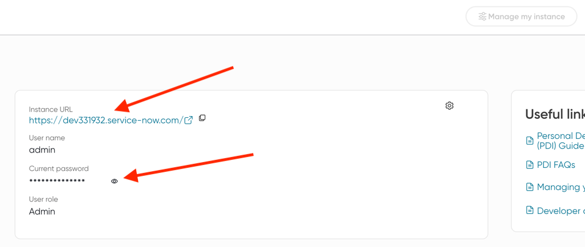
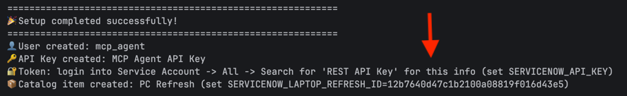
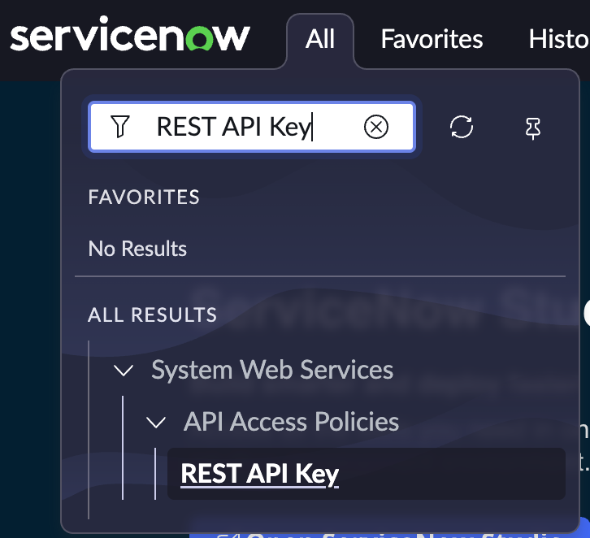

# ServiceNow PDI Bootstrap - Automated Setup

This directory contains automation scripts to help set up a ServiceNow Personal Development Instance (PDI) for testing the Blueprint's integration with ServiceNow.

## 🎯 What This Automates

The scripts automate most of the manual steps described in the [ServiceNow PDI Bootstrap - Manual Setup](SERVICE_NOW_BOOTSTRAP_MANUAL.md):

### ✅ Fully Automated Steps
- **User Creation**: Creates the MCP Agent user with proper identity type
- **Password Generation**: Generates secure passwords automatically
- **Role Assignment**: Assigns necessary roles for API access
- **API Key Creation**: Creates and configures REST API keys
- **Authentication Profiles**: Sets up API Key and Basic Auth profiles
- **API Access Policies**: Creates policies for Service Catalog, Table, and UI APIs
- **Catalog Item Creation**: Creates the PC Refresh catalog item
- **Catalog Variables**: Sets up "Requested for" and "Laptop Choices" variables
- **Choice Options**: Populates laptop choice options
- **Evaluation Users**: Creates test users and laptop computers based on mock employee data

## 📋 Prerequisites

1. **ServiceNow PDI Instance**:
   - Follow [Step 1](SERVICE_NOW_BOOTSTRAP_MANUAL.md#step-1---signup--pdi-new-instance) of the ServiceNow PDI Bootstrap - Manual Setup
     - After the instance is ready click "Manage my instance" and note your: Instance URL, Admin Password

       

## 🚀 Quick Start

### 1. Setup Configuration

#### Environment Variables (Required)

Set the following environment variables for security:

```bash
export SERVICENOW_INSTANCE_URL="https://dev12345.service-now.com"
export SERVICENOW_USERNAME="admin"
export SERVICENOW_PASSWORD="your-admin-password"
```

**NOTE:** For the password, on Linux you must escape special characters with a `\` character and do not include quotes around the password value. For example, for the password `%p+wXR2uh3D`, use:

```bash
export SERVICENOW_PASSWORD=\%p\+wXR2uh3D
```

#### Configuration File

The [config.json](../scripts/servicenow-bootstrap/config.json) file contains static configuration settings and is ready to use.

### 2. Install Dependencies

Install the project and its dependencies using uv:

```bash
cd scripts/servicenow-bootstrap
uv sync
```

### 3. Run Complete Setup

Execute the main orchestration script:

```bash
source .venv/bin/activate # make sure python uv binaries are active 
uv run -m servicenow_bootstrap.setup --config config.json
```

The script will:
- Show you what it will do
- Ask for confirmation
- Execute all steps in sequence

### 4. Copy Variables for Automated Validations

1. After setup is complete you should see the following message:

   

2. Save the `SERVICENOW_LAPTOP_REFRESH_ID` & set it as an environment variable for the setup validation.

3. Go to ServiceNow [Manage Instance](https://developer.servicenow.com/dev.do#!/manage-instance):

   i. Click "Start Building"

      

   ii. Click "All" -> Search for "REST API Key"

      

   iii. Click "MCP Agent API Key"

   iv. Click on the right side of the "Token" field click the 🔒icon ("Toggle Password Visibility")

      

   v. Copy and set this as an environment variable named `SERVICENOW_API_KEY`


### 5. Complete manual steps
1. **PC Refresh**: Click "All" -> Search for "Catalog Builder" -> Click "PC Refresh" -> Click "Edit catalog item" -> Click "Access" -> 
   1. Set **Available for:** Browse → Select "Any User" → Click "Save selection"
   2. Set **Not available for:** Browse → Select "Guest User" → Click "Save selection"
   3. Click "Review and submit" -> Click "Submit"
2. **REST API Access**: Click "All" -> Search for "REST API Access Policies" -> 
   1. **Configue MCP Agent - SC**:
      1. **Set REST API:** Click "MCP Agent - SC" -> Click "REST API" dropdown -> Select "Service Catalog API"
      2. **Set Authentication Profiles** Double Click "Insert new row.." -> Search for "API Key" -> Click Green Checkmark
      3. Click "Update"
   2. **Configue "MCP Agent - Table"** 
      1. **Set REST API:**  Click "REST API" dropdown -> Select "Table API"
      2. **Set Authentication Profiles**  repeat same steps as in 2.i.a-b
      3. Click "Update"
   3. **Configue "MCP Agent - UI"**
       1. **Set REST API:**  Click "REST API" dropdown -> Select "UI GlideRecord API"
       2. **Set Authentication Profiles**  repeat same steps as in 2.i.a-b
       3. Click "Update"
        

### 6. Setup Validation

Use the built-in setup validation script to verify your setup:

```bash
# Set environment variables
export SERVICENOW_API_KEY="your_api_key_from_config"                    # From step 4
export SERVICENOW_LAPTOP_REFRESH_ID="your_catalog_item_id"              # From step 4
export SERVICENOW_INSTANCE_URL="https://your-instance.service-now.com"  # Same variable as used for the setup

# Run the comprehensive setup validation
source .venv/bin/activate # make sure python uv binaries are active
uv run python -m servicenow_bootstrap.setup_validations
```

This will test:
- CMDB Computers API access
- Service Catalog Item retrieval
- Catalog Items Table access
- Catalog Order endpoint authentication

If you are setting up your Service Now instance as part of following the flow in README.md the setup
is now complate and you can return the next step in the README.md.

### 7. Verification
The setup process automatically creates evaluation users and test data that match the mock employee data used by the blueprint. You can verify these were created by:

1. **Check ServiceNow Users**: Go to "All" → Search for "Users" → Verify test users exist
2. **Check Computer Assets**: Go to "All" → Search for "Computers" → Verify laptop assets were created
3. **Review Setup Summary**: The setup output shows detailed statistics of what was created

If you need to skip evaluation users creation, use the `--skip-evaluation-users` flag.

## 📜 Individual Scripts

You can also run individual automation modules using Python's module syntax. Note that all these steps are included when you run `uv run -m servicenow_bootstrap.setup --config config.json`, but can be run separately if needed:

### Create MCP Agent User
```bash
uv run python -m servicenow_bootstrap.create_mcp_agent_user --config config.json
```
Creates the MCP Agent user, generates password, and assigns roles.

### Create MCP Agent API Key
```bash
uv run python -m servicenow_bootstrap.create_mcp_agent_api_key --config config.json
```
Sets up API keys, authentication profiles, and access policies.

### Create PC Refresh Service Catalog Item
```bash
uv run python -m servicenow_bootstrap.create_pc_refresh_service_catalog_item --config config.json
```
Creates the PC Refresh catalog item with variables and choices.

### Create Evaluation Users
```bash
uv run python -m servicenow_bootstrap.create_evaluation_users
```
Creates test users and laptop computers based on mock employee data. Requires the same environment variables as the main setup:
- `SERVICENOW_INSTANCE_URL`: Your ServiceNow instance URL
- `SERVICENOW_USERNAME`: Admin username
- `SERVICENOW_PASSWORD`: Admin password

### Setup Validations
```bash
uv run python -m servicenow_bootstrap.setup_validations
```
Validates the ServiceNow setup by testing API Key credentials against various endpoints to verify connectivity and permissions. Requires environment variables:
- `SERVICENOW_API_KEY`: The API key for authentication
- `SERVICENOW_LAPTOP_REFRESH_ID`: The catalog item ID for laptop refresh
- `SERVICENOW_INSTANCE_URL`: Your ServiceNow instance URL

## 🔧 Advanced Usage

### Skip Specific Steps

```bash
# Skip user creation (if already done)
uv run -m servicenow_bootstrap.setup --config config.json --skip-user

# Skip API setup
uv run -m servicenow_bootstrap.setup --config config.json --skip-api

# Skip catalog creation
uv run -m servicenow_bootstrap.setup --config config.json --skip-catalog

# Skip evaluation users creation
uv run -m servicenow_bootstrap.setup --config config.json --skip-evaluation-users

# Run without confirmation prompts
uv run -m servicenow_bootstrap.setup --config config.json --no-confirm
```

### Re-running Scripts

The scripts are designed to be idempotent - you can run them multiple times safely. They will:
- Skip creation if items already exist
- Update existing configurations where appropriate
- Not duplicate data

## 🛠️ Troubleshooting

### Common Issues

1. **Authentication Failed**
   - Verify your admin username and password
   - Check that your instance URL is correct
   - Ensure you have admin privileges

2. **API Not Found Errors**
   - Some ServiceNow versions might have different API names
   - Check your ServiceNow version compatibility

3. **Permission Denied**
   - Ensure your admin user has sufficient privileges
   - Some operations might require specific roles

4. **Categories Not Found**
   - The script looks for Hardware, Laptops, and Hardware Asset categories
   - If these don't exist, the catalog item will be created without categories
   - You can manually assign categories later

### Debug Mode

For more detailed output, you can modify the scripts to enable debug logging:

```python
import logging
logging.basicConfig(level=logging.DEBUG)
```

## 📚 Related Documentation

- [ServiceNow PDI Bootstrap - Manual Setup](SERVICE_NOW_BOOTSTRAP_MANUAL.md) - Manual setup instructions
- [ServiceNow REST API Documentation](https://docs.servicenow.com/bundle/utah-application-development/page/integrate/inbound-rest/concept/c_RESTAPI.html)

### Development Setup
```bash
# Clone and navigate to the project
cd scripts/servicenow-bootstrap

# Install with development dependencies
uv sync --group dev

# Run linting and formatting
uv run black src/ tests/
uv run flake8 src/ tests/
uv run isort src/ tests/

# Run type checking
uv run mypy src/

# Run tests (when available)
uv run pytest
```
